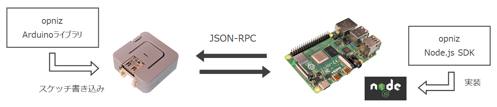
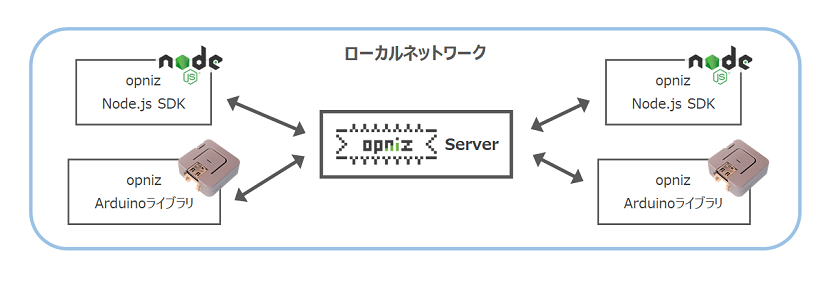
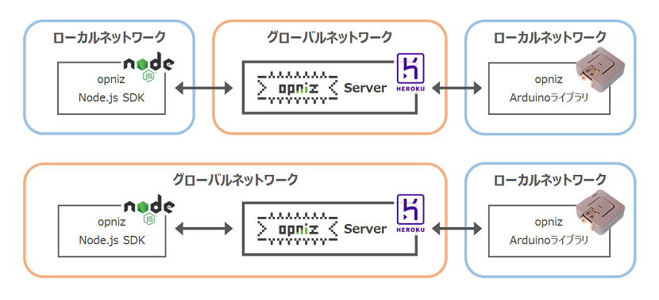

# opniz Server


> ❗ このプロジェクトは現在アルファ版です。

opnizとはM5StackといったESP32デバイスをNode.jsからobnizライクに遠隔制御するための、**Node.js SDK**および**Arduinoライブラリ**です。  
しくみとしてはESP32デバイスおよびNode.js SDK間にて**JSON形式のRPCメッセージ**をやりとりし、相互に定義されたメソッドを呼び合います。  



opniz Serverはopniz Node.js SDKやopnizデバイスからのJSON RPCメッセージを中継するWebSocketサーバです。  
opniz Serverを介すことでWebSocketクライアント同士の接続（opnizデバイス、ブラウザ、Node.js SDK等）を行えます。  



クラウド環境（PaaS、FaaS等）でも動作するため、たとえば手元のPCで動作させたopniz Node.js SDKからインターネット越しの環境にあるopnizデバイスを制御するといったことも可能です。  




## インストール方法

```
npm install opniz-server
```


## 使い方

ポート番号を指定するだけでサーバが起動します。  

```js
const { OpnizServer } = require("opniz-server")

const port = 3000

const server = new OpnizServer(port)
```

opnizクライアントからはopniz Serverのアドレス、ポート番号に加え、opniz Serverを経由して接続したいopnizデバイスと共通のID（任意の文字列）を指定し接続します。  
IDは合言葉のようなものでopniz Serverにて同じIDを使用して接続しているopnizクライアント同士をマッチングします。  

以下はNode.js SDKのサンプルコードです。  
opniz Serverを経由して接続したopnizデバイスのヒープメモリサイズを1秒おきに取得します。  

```js
// Node.js SDK Client

const { Opniz } = require("opniz")

const address = "127.0.0.1" // opniz Serverのアドレスを指定
const port = 3000           // opniz Serverのポート番号を指定
const id = "1234-5678"      // opniz Serverを経由して接続したいopnizデバイスで指定したIDと同じ任意の文字列を指定
const opniz = new Opniz.Esp32({ address, port, id }) // opnizインスタンス生成


; (async () => {
	while (!(await opniz.connect())) { console.log("connect...") } // opniz Serverを経由してopnizデバイスへ接続
	
	setInterval(async () => {
		console.log(await opniz.getFreeHeap()) // opnizデバイスのヒープメモリーサイズを取得して表示
	}, 1000)
})()
```

以下はopnizデバイス（Arduino Library）のサンプルコードです。  
Node.js SDKと同様にopniz Serverのアドレス、ポート番号と、Node.js SDKと同じ値となる任意のIDを指定し接続します。  

```cpp
// Arduino Library Client

#include <OpnizEsp32.h>
#include <lib/WiFiConnector.h>

const char* ssid = "<SSID>";         // Wi-FiのSSIDに書き換え
const char* password = "<PASSWORD>"; // Wi-Fiのパスワードに書き換え
WiFiConnector wifiConnector(ssid, password); // Wi-Fi接続ヘルパーインスタンス生成

const char* address = "192.168.0.1"; // opniz Serverのアドレスを指定
const uint16_t port = 3000;          // opniz Serverのポート番号を指定
const String id = "1234-5678";       // opniz Serverを経由して接続したいNode.js SDKで指定したIDと同じ任意の文字列を指定
Opniz::Esp32* opniz = new Opniz::Esp32(address, port, id); // opnizインスタンス生成


void setup() {
    wifiConnector.connect(); // Wi-Fi接続
    opniz->connect();        // opniz Serverを経由してNode.js SDKへ接続
}

void loop() {
    opniz->loop();         // opnizメインループ
    wifiConnector.watch(); // Wi-Fi接続監視
}
```


### Herokuへデプロイ

クラウド環境へのデプロイの一例としてHerokuへデプロイしてみます。  
ポート番号を`process.env.PORT`と指定することがポイントです。  

```js
const { OpnizServer } = require("opniz-server")

const port = process.env.PORT

const server = new OpnizServer(port)
```

Herokuにデプロイした環境をおためし環境として公開しています。  
`intense-hollows-77613.herokuapp.com`にアクセスすることで実際にお試しいただけます。  

以下がおためし環境へ接続するNode.js SDKとArduino Libraryのサンプルコードです。  
おためし環境を経由して接続するopnizデバイス（M5ATOM）のLEDを緑色に点滅します。  

まずはNode.js SDKのサンプルコードです。  
`id`の値を書き換えてご利用ください。  

```js
// Node.js SDK Client

const { Opniz } = require("opniz")

const address = "intense-hollows-77613.herokuapp.com" // Herokuの公開アプリドメイン
const port = 80                                       // 80番ポートを指定
const id = "1234-5678"                                // opniz Serverを経由して接続したいopnizデバイスで指定したIDと同じ任意の文字列を指定
const opniz = new Opniz.M5Atom({ address, port, id }) // opnizインスタンス生成


const OFF = "#000000"
const GREEN = "#ff0000"
let color = OFF

const main = async () => {
	try {
		// opniz Serverを経由してopnizデバイスへ接続
		while (!(await opniz.connect())) { console.log("connect...") }
		
		for (;;) {
			color = color === OFF ? GREEN : OFF
			await opniz.dis.drawpix(0, color) // opnizデバイス（M5ATOM）のLEDを緑色に点滅
			console.log(color)
			await opniz.sleep(500)
		}
	} catch (e) {
		await main()
	}
}
main()
```

次にopnizデバイス（Arduino Library）のサンプルコードです。  
`id`の値はNode.js SDKのコードと同じ任意の値を指定してください。  

```cpp
// Arduino Library Client

#include <OpnizM5Atom.h>
#include <lib/WiFiConnector.h>

const char* ssid = "<SSID>";         // Wi-FiのSSIDに書き換え
const char* password = "<PASSWORD>"; // Wi-Fiのパスワードに書き換え
WiFiConnector wifiConnector(ssid, password); // Wi-Fi接続ヘルパーインスタンス生成

const char* address = "intense-hollows-77613.herokuapp.com"; // Herokuの公開アプリドメイン
const uint16_t port = 80;                                    // 80番ポートを指定
const String id = "1234-5678";                               // opniz Serverを経由して接続したいNode.js SDKで指定したIDと同じ任意の文字列を指定
Opniz::M5Atom* opniz = new Opniz::M5Atom(address, port, id); // opnizインスタンス生成（テスト用Herokuサーバへ接続）


void setup() {
    initM5(); // M5ATOM初期化
    wifiConnector.connect(); // Wi-Fi接続
    opniz->connect();        // opniz Serverを経由してNode.js SDKへ接続
}

void loop() {
    opniz->loop();         // opnizメインループ
    wifiConnector.watch(); // Wi-Fi接続監視
}
```


## API

opniz Serverではopnizクライアントからのイベントが発生したタイミングで任意の制御を行えるAPIを用意しています。  

### onconnection / onconnect

`onconnection`、`onconnect`にてopnizクライアントからの接続情報を取得できます。  
`onconnection`はopnizクライアントからopniz Serverへアクセスしたタイミングで呼び出されます。  
その後IDが一致するopnizクライアント同士の接続が完了したタイミングで`onconnect`が呼び出されます。  

パラメータの`opnizId`はopnizクライアントにて指定されたIDです。  
`socket`、`primary`、`secondary`はSocket.IOのSocketオブジェクトです。  

``` js
const { OpnizServer } = require("opniz-server")

const port = 3000

const server = new OpnizServer(port)

// opnizクライアントからopniz Serverへのアクセス時に呼び出し
server.onconnection = (opnizId, socket) => {
	console.log(opnizId, socket.id)
}

// IDが一致するopnizクライアント同士の接続完了時に呼び出し
server.onconnect = (opnizId, primary, secondary) => {
	console.log(opnizId, primary.id, secondary.id)
}
```

### onrequest / onresponse

`onrequest`、`onresponse`にてopnizクライアントからのリクエスト/レスポンスをハンドリングできます。  
`payload`が生データとなり、`src`が送信元、`dist`送信先のSocket.IOのSocketオブジェクトです。  
これによりログを取得したり`payload`の書き換えが行えます。  

```js
const { OpnizServer } = require("opniz-server")

const port = 3000

const server = new OpnizServer(port)

// opnizクライアントからのリクエストをハンドリング
server.onrequest = async (payload, src, dist) => {
	console.log(payload)
	return payload
}

// opnizクライアントからのレスポンスをハンドリング
server.onresponse = async (payload, src, dist) => {
	console.log(payload)
	return payload
}
```


## ドキュメント

[TypeDoc](https://miso-develop.github.io/opniz-server/)


## 関連リポジトリ

* [opniz SDK for Node.js](https://github.com/miso-develop/opniz-sdk-nodejs)
	* opnizデバイスをNode.jsから遠隔制御するためのSDK
* [opniz Arduino Library for M5ATOM](https://github.com/miso-develop/opniz-arduino-m5atom)
	* M5ATOM向けArduinoライブラリ
* [opniz Arduino Library for ESP32](https://github.com/miso-develop/opniz-arduino-esp32)
	* ESP32向けArduinoライブラリ
* [opniz CLI](https://github.com/miso-develop/opniz-cli)
	* opniz Arduino LibraryのBasicスケッチをコマンドから簡単に書き込めるCLIツール


## ライセンス

[MIT](./LICENSE)
